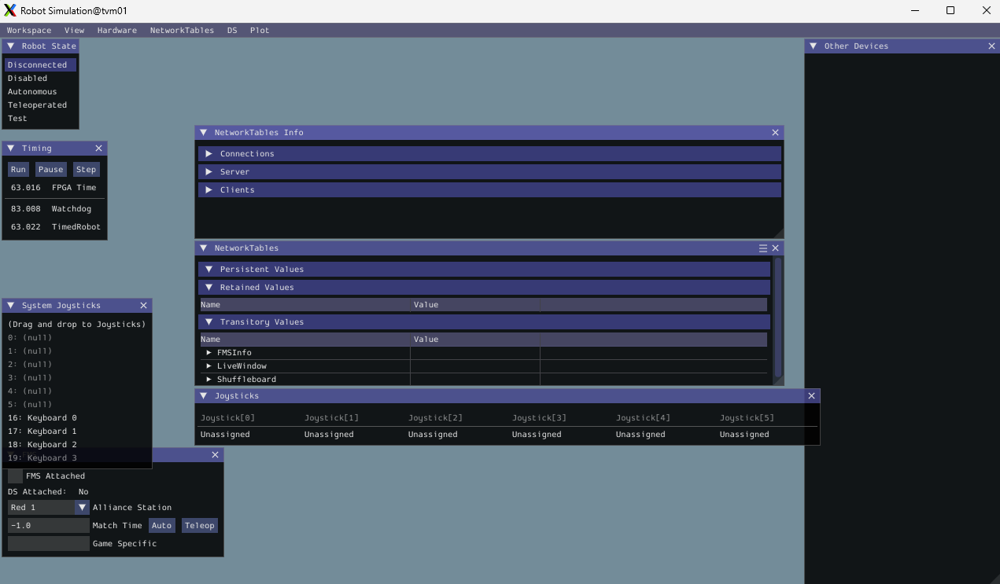

# Investigation into PathPlanner with the XRP Robot

I am new to the First Robotics Challenge and I am working as a programing mentor for Team
6107 [CyberJagzz](https://www.cyberjagzz.org/) in Huntsville, Alabama. They had previously
used Java in previous competitions, but I am hoping to get our freshmen class proficient 
in Python via robotics so a continuous stream of new teammates can learn robotics and python 
in the years to come.

While you can clone the repository and learn from it, I hope you also can use various
steps that I went through to learn as well. 

At the end, I have some reference links that may be of help.

# Goals
 
- [ ] Set up a robotpy project from scratch
- [ ] Get a very simple framework set up and running under simulation and on the XRP
- [ ] Begin improvements to connect up a controller/joystick
- [ ] Get the robot to actually move
- [ ] Implement some unit tests
- [ ] Setting up a Makefile to allow you shell environment to be simple to use
- [ ] Learn the PathPlanner tool and apply it to a simple robot (XRP)
- [ ] Implement both autonomous and teleop modes
- [ ] Split off common code that can be used from year to year
- [ ] Learn about telemetry and all the other things I do not know yet that will help on the real competition robot.

# This base directory
The code in this base directory, plus the [frc-2026](frc_026) and [lib-6107](lib_6107) should run as final
completed code. Of course if you are using this as I write it (Fall of 2025), then consider it a work
in progress and check in as I get each step's [goals](#Goals) completed.

**TODO**: _If you see this line in the README, I am still writing this document_

# Step-0: Starting point

- [X] Set up a robotpy project from scratch
Skeleton files exist in the [step-00](/steps/step-00) subdirectory

Installed robotpy and performed init (I am using python 3.13.9 since I am learning for the 2026 competition)

```shell
mkdir -p xrp-pathplanner/robot && cd xrp-pathplanner/robot
python3 -m pip install pyrobot
python3 -m robotpy init
```
Then modify your pyproject.toml **robotpy_extras** to enable the _commands2_, _pathplannerlib_, and _xrp_ modules.
You can then sync your environment with the **robotpy** _sync_ command.
```shell
python3 -m robotpy sync
```
## Using a virtual environment
A virtual environment can be used if you wish to keep in separate from your other projects. This also
will help in keeping a consistent environment for your development.

### Creating the virtual python environment
Run the supplied **env.sh** script if you are on a linux or macOS system. You can manually perform the commands
if you are on Windows. An alternative if you have windows is to load the Windows Subsystem for Linux (WSL) and
use a bash shell in that environment instead. You can edit with you favorite Windows based IDE and execute command
lines in the bash shell.

Both the env.sh and reqirements-2026.txt were hand created. I often like to create a _Makefile_ and use **make**
command to do a bunch of my work from the command line. The _Makefile_ will be set up in []

```shell
source ./env.sh
```
This will create the same environment as the **python3 -m robotpy sync** command.  Should you log out
and need to re-enter the virtual environment, execute the same **env.sh** command above. It will activate
the virtual environment
 
# Step-1: Improve your initial files and directory structure

- [X] Get a very simple framework set up and running under simulation and on the XRP

This step creates our initial files and subdirectories. This the framework for everything will be done in the
first several steps. Completed files/directories exist in the [Step-1](/steps/step-01) subdirectory. Diff them with [Step-0](/steps/step-00)
to see what changed. 

First move all the files that we are going to 'copy over' from the Step-1 directory to a backup
location and then copy in the [Step-1](/steps/step-01) files. We will then describe what each file does and
I wrote it that way.

```shell
# This assumes you are in the .../xrp-pathplanner/robot subdirectory. This will
# copy all the source for step-1 into the base robot subdirectory and insure the
# virtual environment is set up

mkdir -p .backup/before-step-1 && mv pyproject.toml robot.py .backup/before-step-1/ && \
cp -rp ../steps/step-01 . && source ./env.sh
```
If all completed successfully, you should have all the files needed for step-1 completed and
your virtual environment initialized. All files are just skeletons of what we will be working
on later, so jost doing a blind copy is much easier. In later steps, we will be doing file-by-file
changes instead.

Once your files in the base [robot](robot) subdirectory are up to date what is in the
[steps-1](steps/step-00) subdirectory, it is now time launch it in the simulator.

```shell
source ./env.sh       # if needed

robotpy sim
#############################
# And you should see output similar to the following
WARNING: Error detected in EntryPoint(name='xrp', value='xrp.extension', group='robotpysimext')
19:50:25:180 INFO    : faulthandler        : registered SIGUSR2 for PID 257665
19:50:25:191 INFO    : halsim_gui          : WPILib HAL Simulation 2025.3.2.2
HAL Extensions: Attempting to load: libhalsim_gui
Simulator GUI Initializing.
Simulator GUI Initialized!
HAL Extensions: Successfully loaded extension
19:50:26:331 WARNING : pyfrc.physics       : Cannot enable physics support, /opt/repos/cboling/xrp-pathplanner/robot/physics.py not found
19:50:26:334 INFO    : wpilib              : RobotPy version 2025.3.2.2
19:50:26:334 INFO    : wpilib              : WPILib version 2025.3.2.2
19:50:26:334 INFO    : wpilib              : Running with simulated HAL.
19:50:26:343 INFO    : nt                  : could not open persistent file 'networktables.json': No such file or directory (this can be ignored if you aren't expecting persistent values)
19:50:26:343 INFO    : nt                  : Listening on NT3 port 1735, NT4 port 5810
Not loading CameraServerShared
19:50:26:355 INFO    : robot               : Python: 3.13.7, Software Version: 2025.11.07

********** Robot program startup complete **********
```
And a window to the [Simulation GUI](https://docs.wpilib.org/en/stable/docs/software/wpilib-tools/robot-simulation/simulation-gui.html#simulation-specific-user-interface-elements)
which is very simular to the [glass](https://docs.wpilib.org/en/stable/docs/software/dashboards/glass/index.html)
application should show up and be simular to the following image. This GUI allows teams to
easily visualize their robot's inputs and outputs.


**NOTE**: If **glass** did not start refer to
[Errors Encountered](#Step-1: Errors Encountered).

Well, that is about it. You can drag a keyboard over to the Joystick display and use your keyboard
as the joystick, but the simulated robot will not move, because it does not have a drive subsystem d
defined. You can either enter **^c** in the cli terminal or navigate to leftmost GUI dropdown
menu and select the "Exit" option.

The following sections provide more information on the files, objects, and subsystems
that are used in this step. 

## robot.py
This is the main entry point for the **wsilib** to run our robot code. I chose to use the
TimedCommandRobot base class as it provides a very simple environment to run in with
plenty of Python and other language examples available.

In general, very little will change in this file as we progress through our stages. As we
add capabilities and fill out the functions, more information will be provided.

### robotInit
This is called by the RobotBase (wpilib) code on initial startup to allow us to
initialize the robot

### Key Takeaways
Here are some key concepts that the [robot.py](robot/robot.py) file hides (abstracts) to make

#### TimedCommandRobot
Specifically, **TimedCommandRobot** specific implementation of TimedCommandRobot that automatically 
runs the TimedCommandRobot during autonomous mode, making it easier to manage autonomous routines.

#### CommandScheduler
The core of the command-based framework. It keeps track of which commands are running and ensures
that only one command for a specific subsystem is active at any given time.

## frc-2026 Subdirectory
This subdirectory contains all the code (written in 2026) for this project. While this XRP
example is being written for myself and Team 6107 to learn from, it will mimic what we
will do for the FRC 2026 challenge.

Basically, we will be coding and experimenting here. As the code matures, we may begin to
break of re-usable portions and place them in the [lib-6107](lib_6107) subdirectories.

### constants.py
This file (and other _constants.py_ file) are currently empty. They will be used for
defining constants and enumerations that are used by python files in this subdirectory
branch and/or imported by other subdirectories.

## robotcontainer.py
This file holds the **RobotContainer** class that contains the bulk of the python
code that creates the various subsystems, commands, and button mappings. 

Some of the common work done in initialization is defined with **TODO** comments. As
we progress through our lesson steps, these will be come calls to one or more methods
of this object.

### autonomous Subdirectory
This subdirectory will contain the commands that can be/are used when the robot is
in autonomous mode.

### commands Subdirectory
This subdirectory will provide commands and command groups that are used during
the challenge. I have not yet decided if I should break these down along
subsystem lines (or subsystem types) or as a flat set of files.

### subsystems Subdirectory
This subdirectory will contain further subdirectories for each subsystem on our 2026
robot. For this XRP example, this will be a small number of subsystems

## lib_6107 Subdirectory
This subdirectory will eventually contain re-usable functions, base classes, and other resources
that will be re-usable from year-to-year. For now, it is empty, but in one of our last steps, the
existing [frc-2026](../frc-2026) code will be refactored and the initial library will be created. The
first consumer of that new library, besides this example, will be Team 6107's 2026 robot. It will not
be based on an XRP, but the actual deal. That project will also follow this same design pattern and
hopefully will be helpful to other FRC Teams in the 2026 competition as well as the future.

## Step-1: Errors Encountered
If when you run your **robotpy sim** you get the following error:
```text
HAL Extensions: Attempting to load: libhalsim_gui
Simulator GUI Initializing.
GLFW Error 65543: GLX: Failed to create context: GLXBadFBConfig
```
Then you may need to upgrade your OpenGL support to 3.3 or higher. On Linux you can
run the following command
```shell
# If you do not have the 'glxinfo' tool, you can install it with 'sudo apt install mesa-utils'

glxinfo | grep opengl
```
If you are running on WSL, then it may not be able to show the Glass Tools

# Step-2: Hook up a controller
- [X] Begin improvements to connect up a controller/joystick


# Step-3: Lets get the robot to move
- [X] Get the robot to actually move

So far, even if we downloaded the code in Step 2, the robot will not move and so the simulator
GUI was our only option. In this step, we will create a drive subsystem, in its basic and
most simple form, and tie it to the controller so we can get the robot to move.

# Step-4: Makefiles and the CLI
- [X] Setting up a Makefile to allow you shell environment to be simple to use


# Step-5: PathPlanner
- [X] Learn the PathPlanner tool and apply it to a simple robot (XRP)


# Step-6: Time for a Challenge
- [ ] Implement both autonomous and teleop modes


# Step-7: Code Refactoring
- [ ] Split off common code that can be used from year to year


# Step-8: Telemetry and the things we never knew existed
- [ ] Learn about telemetry and all the other things I do not know yet that will help on the real competition robot.


# References

 - [pyrobot](https://pyrobot.org/docs/overview.html)
 - [PathPlanner Docs](https://pathplanner.dev/home.html) - motion profile generator
 - [PathPlanner Python API](https://pathplanner.dev/api/python/)
 - [PathPlanner getting started](https://pathplanner.dev/pplib-getting-started.html)
 - [Command](https://robotpy.readthedocs.io/projects/commands-v2/en/stable/commands2/Command.html) - robotpy 'Command' class
 - [Simulation GUI](https://docs.wpilib.org/en/stable/docs/software/wpilib-tools/robot-simulation/simulation-gui.html#simulation-specific-user-interface-elements)
 - [glass GUI Application](https://docs.wpilib.org/en/stable/docs/software/dashboards/glass/index.html)
